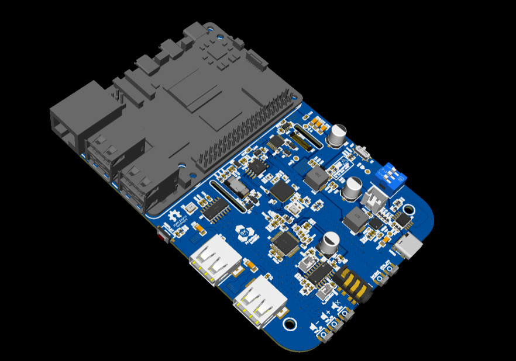
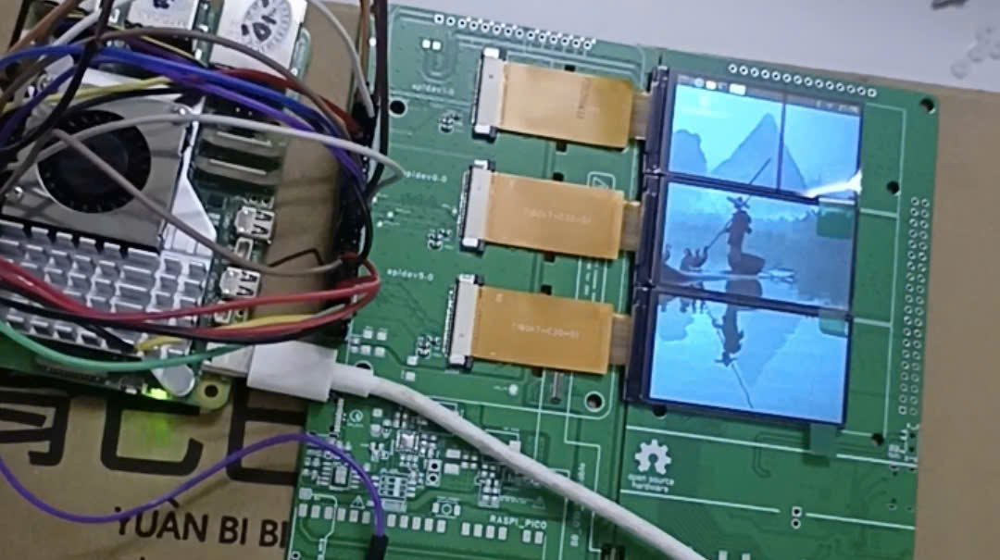

# cheepy_pi

A budget-friendly, fully opensource DIY mini Cyberdeck powered by Raspberry Pi Model B, featuring a custom BQ25895+TPS61236P UPS, 3 cheap ST7789 display and audio system.

  

## Features
* **Processor:** Powered by Raspberry Pi Model B.
* **Power System:** Custom UPS utilizing BQ25894 + TPS61236P. It integrates a **CH220K** fast-charging sink controller at the input to negotiate up to a **12V input voltage** from Type-C PD charger, significantly boosting input power and enabling faster charging/stable high-load operation when plugged in.
* **Display System:** 
  * Triple (3x) low-cost ST7789 1.9" main screens.
  * An extra 2.25" ST7789 display dedicated to monitoring and displaying real-time battery status, independently managed by an onboard RP2040 microcontroller.
* **Input:** Integrated classic Blackberry Q20 keyboard, also driven and managed by the RP2040 to act as a custom USB HID device.

* **Audio:** Integrated audio system.
  
##  Current Status & Testing
* **Hardware Status:** The project is currently in the prototype stage. I am waiting for the PCBs and components to arrive for soldering, hardware debugging, and error verification. Updates will be posted as soon as testing is complete!

  

* **Software/Driver Notice:** 
  The current driver for the triple (3x) ST7789 display system **only supports the latest Raspberry Pi OS** and other Linux distributions utilizing the ́**Wayland** display server protocol. Traditional X11/Xorg environments are not supported.
